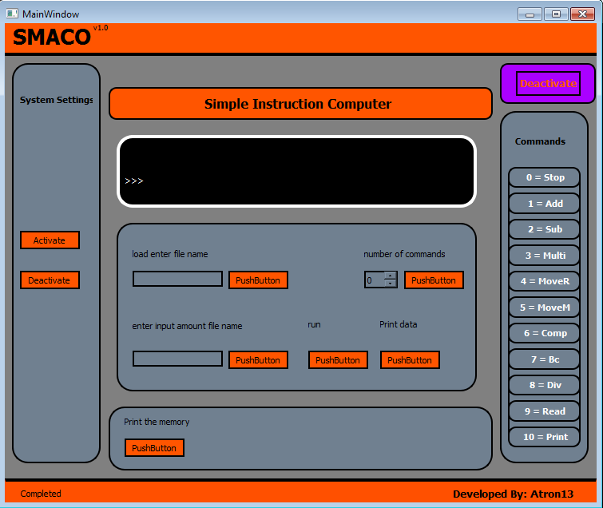

## SMACO - Simple Instruction Computer

Smaco is a concept in System Programming.
Simple Instruction Computer (SMACO) is a hypothetical machine with a small but effective instruction set that can be used illustrate the design of simple software processors involved in development of programs for providing the load, run, read, print commands.

## Features -

	1 Can perform any problem written in the machine language code
	2 Many validation are added but more can be added
	3 Seperate file are added for commands and for inputs
	4 Instruction are to be added
	5 Provide the instruction set for user

## Requirement -

	1 PyQt5
	2 Python3
	3 Any Code editor
	
## Commands -

	0	stop
	1	add
	2	sub
	3	multi
	4	mover
	5	movem
	6	comp
	7	bc
	8	div
	9	read
	10	print

## Problems -

	1 Validation is not completed
	2 Signal are not included

## Improvements -

	1 More improvements can be done.

## Test -

	1 Multiple test are performed to check the bugs in SMACO

## Developed by - 
	Atharva Ayati

## ScreenShot -

